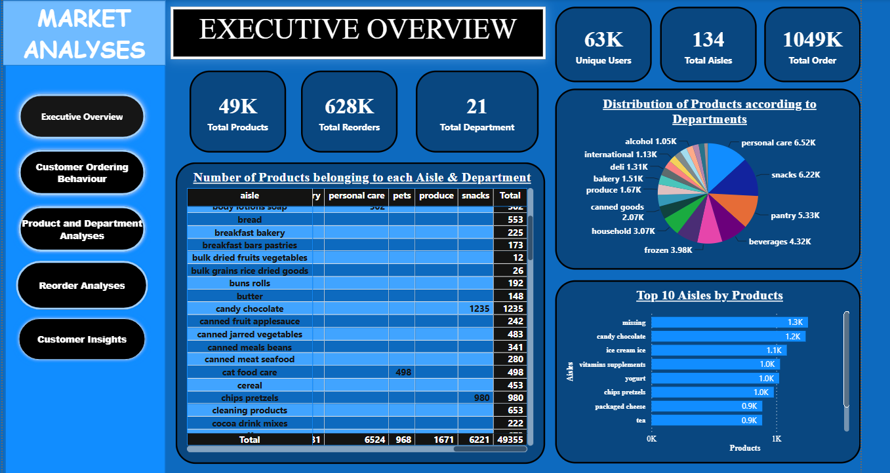
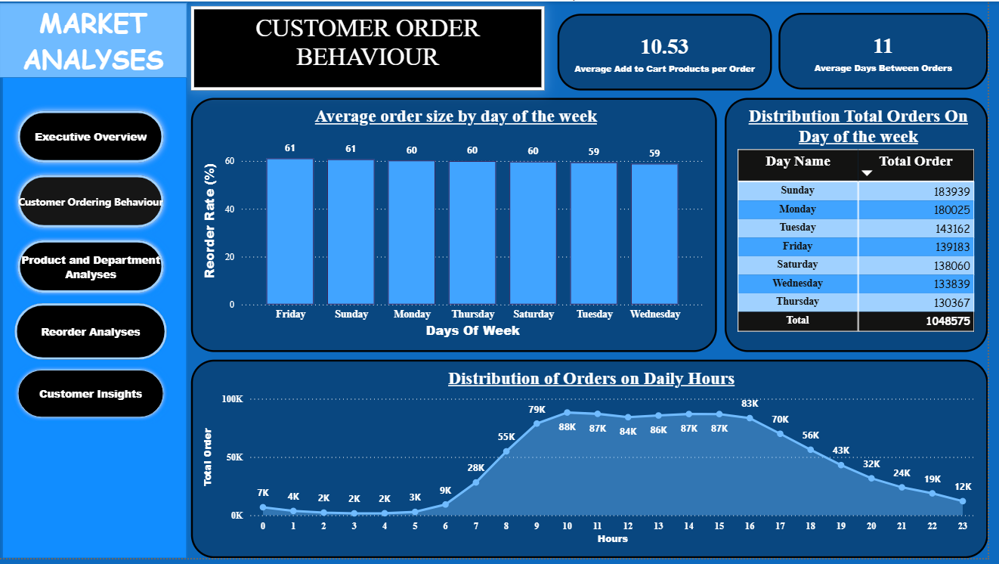
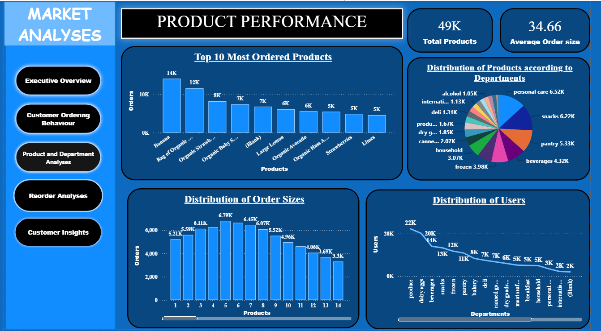
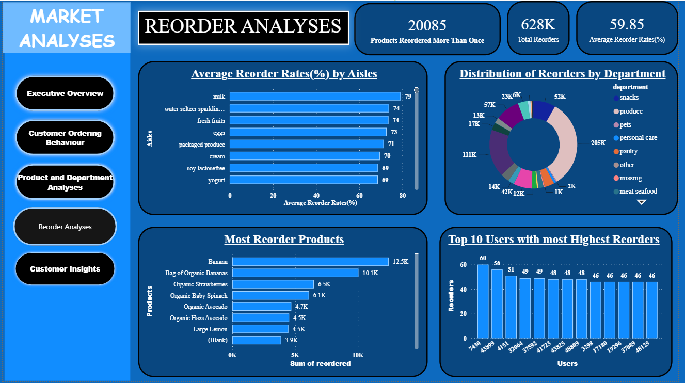
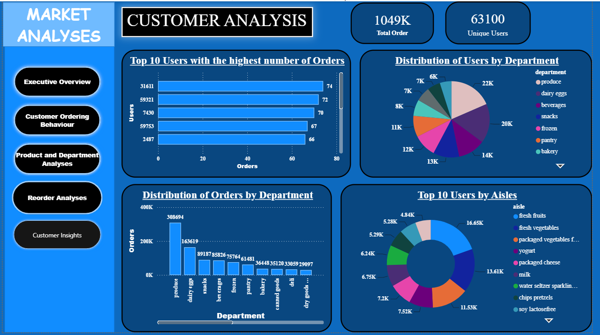

# 📊 Retail Market Analysis Dashboard

## 📌 Project Overview

This project analyzes a large-scale online retail dataset to uncover valuable business insights related to customer purchasing behavior, product performance, reorder trends, and shopping patterns.

Using MySQL for data preparation and Power BI for interactive dashboards, the project transforms raw transactional data into actionable insights that help businesses improve inventory management, customer retention, and marketing strategies.

---

# 🎯 Business Objectives

- Analyze customer purchasing behavior
- Identify top-selling products
- Measure customer reorder rates
- Study customer shopping patterns
- Analyze peak shopping days and hours
- Evaluate department and aisle performance
- Generate business recommendations through interactive dashboards

---

# 🛠️ Tools & Technologies

- MySQL
- Power BI
- Power Query
- DAX
- Data Modeling

---

# 📂 Dataset

The project uses multiple related datasets:

- Orders
- Order Products
- Products
- Aisles
- Departments

The datasets are connected using:

- order_id
- product_id
- aisle_id
- department_id

---

# 📊 Dashboards

## Executive Overview Dashboard

Shows:

- Total Orders
- Unique Customers
- Products
- Departments
- Aisles
- Overall Business KPIs

---

## Customer Order Behavior Dashboard

Analyzes:

- Orders by Day
- Orders by Hour
- Average Days Between Orders
- Average Basket Size
- Customer Shopping Pattern

---

## Product Performance Dashboard

Includes:

- Top Ordered Products
- Product Distribution
- Department Analysis
- Average Products per Order

---

## Reorder Analysis Dashboard

Shows:

- Reorder Rate
- Top Reordered Products
- Customer Loyalty
- High Performing Categories

---

## Customer Analysis Dashboard

Includes:

- Active Customers
- Department-wise Users
- Customer Purchasing Pattern
- Loyal Customers

---

# 📈 Key Business Insights

- More than **1.04 million** customer orders were analyzed.
- The business serves approximately **63,000 unique customers**.
- Around **49,000 products** are distributed across **21 departments** and **134 aisles**.
- Bananas and Organic Bananas are the most ordered and most reordered products.
- Produce, Snacks, Pantry, and Personal Care are the highest-performing departments.
- Customers place repeat orders approximately every **11 days**.
- The average reorder rate is nearly **60%**, indicating strong customer loyalty.
- Customer activity is highest during the daytime, with clear peak shopping hours.

---

# 💼 Business Recommendations

- Improve inventory planning for high-demand products.
- Launch personalized marketing campaigns.
- Strengthen customer loyalty programs.
- Increase cross-selling using product recommendations.
- Optimize staffing during peak shopping hours.
- Improve product categorization for better reporting.

---

# 📚 Skills Demonstrated

- SQL Query Writing
- Data Cleaning
- Data Modeling
- Power Query
- DAX Measures
- KPI Development
- Dashboard Design
- Business Analysis
- Data Visualization
- Business Intelligence

---

# 🚀 Business Impact

The dashboard enables stakeholders to monitor customer behavior, optimize inventory, improve product placement, strengthen customer retention strategies, and make informed business decisions through interactive visual analytics.

---

# 👨‍💻 Author

**Deepak R**

Aspiring Data Analyst

Tools: MySQL | Power BI | Power Query | DAX | SQL
